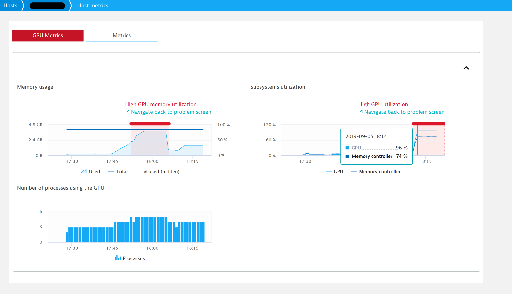

# Foreword
Created by [Tomasz Gajger](https://github.com/tomix86).

**Notice**: although the author is a Dynatrace employee, this is a private project. It is not maintained nor endorsed by the Dynatrace.

The project is released under the [MIT License](LICENSE). 

# Intro

A [Dynatrace OneAgent](https://www.dynatrace.com/support/help/) plugin for gathering NVIDIA GPU metrics using [NVIDIA Management Library (NVML)](https://docs.nvidia.com/deploy/nvml-api/),
implementation leverages [python bindings for NVML](https://pypi.org/project/nvidia-ml-py3/).

The plugin is capable of monitoring multiple GPUs, the metrics coming from all the devices will be aggregated and send as combined timeseries.
There is no support for sending separate timeseries per device.

Note that the plugin can attach metrics to multiple processes at once, but the metrics will only be displayed for processes that were specified in `processTypeNames` in `plugin.json`
If the process type is not specified there, then metrics will still be sent, but won't appear on the WebUI.
Currently there is no way to specify `Any` in `processTypeNames`, hence all the process types of interest need to be explicitly enumerated.

Furthermore, due to current limitations in the Plugin SDK there is no possibility to send metrics for the HOST entity, each metric must be reported per-PGI.
This has an unfortunate consequence of duplicating many of the metrics and can quickly lead to custom metrics quota exhaustion.
Hence, it is advised to not use `detect_pgis_using_gpu` option, but instead specify the PGIs of interest using `detect_pgis_using_gpu`.

## Requirements
* NVML installed and available on the system.
* Device of Fermi or newer architecture.
* No requirements on CUDA version.
* For plugin development: [OneAgent Plugin SDK v1.167 or newer](https://dynatrace.github.io/plugin-sdk/index.html).
* Python >= 3.6.

# Plugin configuration:
* `enable_debug_log` - enables debug logging for troubleshooting purposes,
* `detect_pgis_using_gpu` - makes the plugin auto-detect all the PGIs that use the GPU and send metrics for them.
**Attention**: may result in rapid exhaustion of custom metrics quota,
* `monitored_pg_names` - explicit list of process groups for which the metrics should be sent.
Allows to hand-pick the PGIs that the plugin should monitor, should be preferred to `detect_pgis_using_gpu`.
Note however that these two options can be used simultaneously. 

# Reported metrics:

The table below outlines metrics collected by the plugin. *Figure 1* shows an example how metrics are presented on the WebUI.

| Key                               | Entity | Metric description |
|-----------------------------------|--------|--------------------|
| gpu_mem_total                     | HOST   | Total available global memory |
| gpu_mem_used                      | HOST   | Device (global) memory usage |
| gpu_mem_used_by_pgi               | PGI    | Global memory usage per process |
| gpu_mem_percentage_used           | HOST   | Artificial metric (`gpu_mem_used` / `gpu_mem_total`) for raising _High GPU memory_ alert |
| gpu_utilization                   | HOST   | Percent of time over the past sample period (within CUDA driver) during which one or more kernels was executing on the GPU |
| gpu_memory_controller_utilization | HOST   | Percent of time over the past sample period (within CUDA driver) during which global memory was being read from or written to |
| gpu_processes_count               | HOST   | Number of processes making use of the GPU |

Note that differentiation between entity types is only conceptual, all the metrics are sent per-PGI due to aforementioned limitations of Plugin SDK.

If there are multiple GPUs present, the metrics will be displayed in a joint fashion, i.e:
* `gpu_mem_total` will be a sum of all the devices' global memory,
* `gpu_mem_used` and `gpu_mem_used_by_pgi` will be the total memory usage across all the devices,
* `gpu_utilization` and `gpu_memory_controller_utilization` will be an average from per-device usage metrics,
* `gpu_processes_count` will show unique count of processes using any of the GPUs, i.e. if single process is using two GPUs it will be counted as 1.

\

\
_Fig 1. Metrics reported by the plugin_

Note that although memory usage metrics values are in MiB, we display them as MB on the WebUI since it is the convention for timeseries labelling in Dynatrace.

Internally, the plugin collects several data samples and aggregates them before passing them on to the plugin execution engine.
By default, 5 samples in 2 second intervals are collected. This can be customized by modifying `SAMPLES_COUNT` and `SAMPLING_INTERVAL` in [constants.py](utilities/constants.py).

Concerning per-PGI memory usage, on Windows this metric won't be available if the card is managed by WDDM driver,
the card needs to be running in [TCC (WDM)](https://docs.nvidia.com/gameworks/content/developertools/desktop/nsight/tesla_compute_cluster.htm) mode.
Note that [this mode is not supported by GeForce series cards prior to Volta architecture](https://docs.nvidia.com/gameworks/index.html#developertools/desktop/nsight/system_requirements.htm%23Compute_Debugger_Support
).

# Alerting
Three alerts are predefined in the plugin, all three are generated by the Dynatrace Server when metrics exceed certain threshold values:
* _High GPU utilization_ alert - raised when `gpu_utilization` exceeds predefined threshold (default: 90%) in given time period, example is shown in *Figure 2*,
* _High GPU memory controller utilization_ alert -  raised when `gpu_memory_controller_utilization` exceeds predefined threshold (default: 90%) in given time period,
* _High GPU memory utilization_ alert - raised when `gpu_mem_percentage_used` exceeds predefined threshold (default: 90%) relative to `gpu_mem_total` in given time period.

Alerts thresholds are customizable by going to `WebUI` > `Settings` > `Anomaly Detection` > `Plugin events`.

\

\
_Fig 2. High GPU utilization alert as seen on metrics screen_

Note that _High GPU memory utilization_ alert is based on two separate metrics (`gpu_mem_used` and `gpu_mem_total`). Due to current custom plugins limitations, it is not possible to define such server-side alert without introducing an artificial metric combining the other two.
The alert could be reported by the plugin directly via [`results_builder.report_performance_event()`](https://dynatrace.github.io/plugin-sdk/_apidoc/ruxit.api.html#ruxit.api.results_builder.ResultsBuilder.report_performance_event),
but then it wouldn't be connected to a particular metric (from server's perspective) and wouldn't be marked on the respective chart, it would only appear on the host screen.
Thus, an artificial metric, that is hidden on the _Memory usage_ chart, representing percentage usage of the GPU memory had to be introduced.

# Acknowledgements
* [Bartosz Pollok](https://github.com/bartekmp) for code review and guidance through the Python world