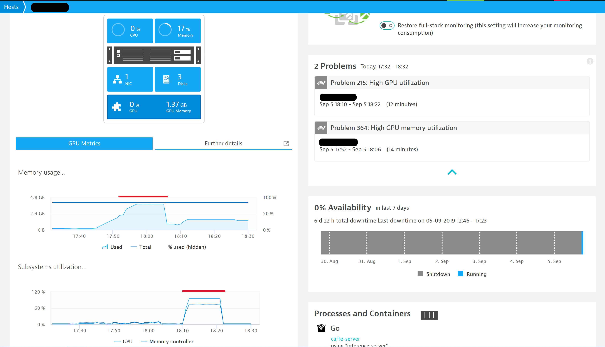
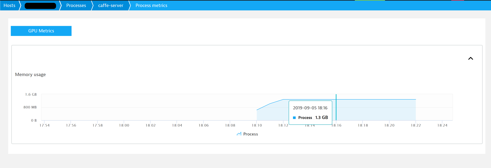
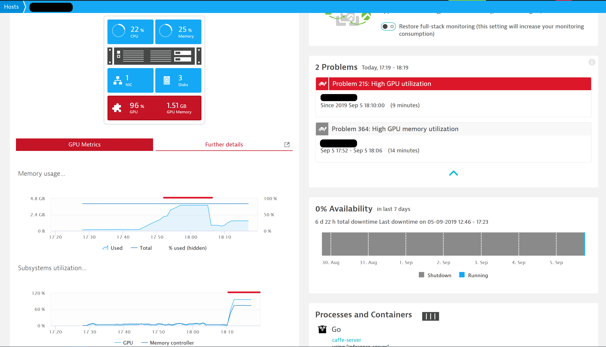
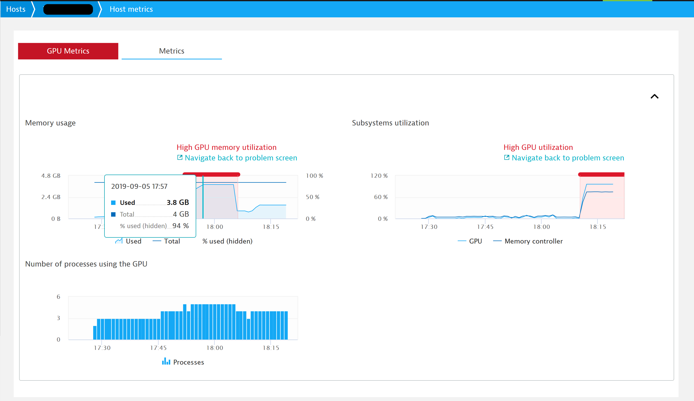
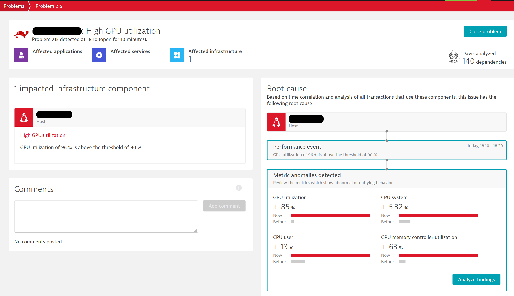
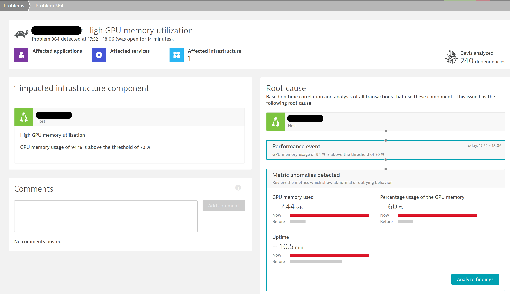

# OneAgent NVML Extension

## Foreword

Created by [Tomasz Gajger](https://github.com/tomix86).

**Notice**: although the author is a Dynatrace employee, this is a private project. It is not maintained nor endorsed by the Dynatrace.

The project is released under the [MIT License](LICENSE).

## Overview

A [Dynatrace OneAgent](https://www.dynatrace.com/support/help/) plugin for gathering NVIDIA GPU metrics using [NVIDIA Management Library (NVML)](https://docs.nvidia.com/deploy/nvml-api/),
implementation leverages [python bindings for NVML](https://pypi.org/project/nvidia-ml-py3/).

The plugin is capable of monitoring multiple GPUs, the metrics coming from all the devices will be aggregated and sent as combined timeseries.
There is no support for sending separate timeseries per device.

Note that the plugin can attach metrics to multiple processes at once, but the metrics will only be displayed for processes that were specified in `processTypeNames` in `plugin.json`
If the process type is not specified there, then metrics will still be sent, but won't appear on the WebUI.
Currently there is no way to specify `Any` in `processTypeNames`, hence all the process types of interest need to be explicitly enumerated.

Device metrics are reported for the HOST entity, while process-specific metrics are reported per-PGI.

### Requirements

* NVML installed and available on the system.
* Device of Fermi or newer architecture.
* No requirements on CUDA version.
* OneAgent version >= 1.175.
* For plugin development: [OneAgent Plugin SDK v1.175 or newer](https://dynatrace.github.io/plugin-sdk/index.html).
* Python >= 3.6.

## Configuration

* `enable_debug_log` - enables debug logging for troubleshooting purposes.

## Reported metrics

The table below outlines metrics collected by the plugin. *Figures 1* and *2* exemplify how metrics are presented on the WebUI.

| Key                               | Entity | Metric description |
|-----------------------------------|--------|--------------------|
| gpu_mem_total                     | HOST   | Total available global memory |
| gpu_mem_used                      | HOST   | Device (global) memory usage |
| gpu_mem_used_by_pgi               | PGI    | Global memory usage per process |
| gpu_mem_percentage_used           | HOST   | Artificial metric (`gpu_mem_used` / `gpu_mem_total`) for raising _High GPU memory_ alert |
| gpu_utilization                   | HOST   | Percent of time over the past sample period (within CUDA driver) during which one or more kernels have been executing on the GPU |
| gpu_memory_controller_utilization | HOST   | Percent of time over the past sample period (within CUDA driver) during which global memory have been read from or written to |
| gpu_processes_count               | HOST   | Number of processes making use of the GPU |

If there are multiple GPUs present, the metrics will be displayed in a joint fashion, i.e:

* `gpu_mem_total` will be a sum of all the devices' global memory,
* `gpu_mem_used` and `gpu_mem_used_by_pgi` will be the total memory usage across all the devices,
* `gpu_utilization` and `gpu_memory_controller_utilization` will be an average from per-device usage metrics,
* `gpu_processes_count` will show unique count of processes using any of the GPUs, i.e. if single process is using two GPUs it will be counted as one.

\
_Fig 1. Host metrics reported by the plugin_

\
_Fig 2. PGI metrics reported by the plugin_

Note that although memory usage metrics values are in MiB, we display them as MB on the WebUI since it is the convention for timeseries labelling in Dynatrace.

Internally, the plugin collects several data samples and aggregates them before passing them on to the plugin execution engine.
By default, 5 samples in 2 second intervals are collected. This can be customized by modifying `SAMPLES_COUNT` and `SAMPLING_INTERVAL` in [constants.py](plugin/utilities/constants.py).

Concerning per-PGI memory usage, on Windows this metric won't be available if the card is managed by WDDM driver,
the card needs to be running in [TCC (WDM)](https://docs.nvidia.com/gameworks/content/developertools/desktop/nsight/tesla_compute_cluster.htm) mode.
Note that [this mode is not supported by GeForce series cards prior to Volta architecture](https://developer.nvidia.com/nsight-visual-studio-edition-supported-gpus-full-list#SupportedComputeConfigs).

## Alerting

Three alerts are predefined in the plugin, all three are generated by Davis when metrics exceed certain threshold values.
These alerts are reported for the host entity and are visible on the host screen, see *Figure 3*.

* _High GPU utilization_ alert - raised when `gpu_utilization` exceeds predefined threshold (default: 90%) in given time period, example is shown in *Figure 4*,
* _High GPU memory controller utilization_ alert - raised when `gpu_memory_controller_utilization` exceeds predefined threshold (default: 90%) in given time period,
* _High GPU memory utilization_ alert - raised when `gpu_mem_percentage_used` exceeds predefined threshold (default: 90%) relative to `gpu_mem_total` in given time period, example is shown in *Figure 5*.

Alerts thresholds are customizable by going to [`WebUI` > `Settings` > `Anomaly Detection` > `Plugin events`](https://www.dynatrace.com/support/help/shortlink/problem-detection-sensitivity).

\
_Fig 3. Alerts as seen on host screen_

\
_Fig 4. High GPU utilization alert as seen on metrics screen_

\
_Fig 5. High GPU memory utilization alert as seen on metrics screen_

Note that _High GPU memory utilization_ alert is based on two separate metrics (`gpu_mem_used` and `gpu_mem_total`).
Due to current custom plugins limitations, it is not possible to define such server-side alert without introducing an artificial metric combining the other two.
The alert could be reported by the plugin directly via [`results_builder.report_performance_event()`](https://dynatrace.github.io/plugin-sdk/_apidoc/ruxit.api.html#ruxit.api.results_builder.ResultsBuilder.report_performance_event),
but then it wouldn't be connected to a particular metric (from server's perspective) and wouldn't be marked on the respective chart, it would only appear on the host screen.
Thus, an artificial metric that is hidden on the _Memory usage_ chart, representing percentage usage of the GPU memory had to be introduced.

\
_Fig 6. Problem view for active high GPU utilization alert_

\
_Fig 7. Problem view for resolved high GPU memory utilization alert_

## Acknowledgements

* [Bartosz Pollok](https://github.com/bartekmp) for code review and guidance through the Python world
